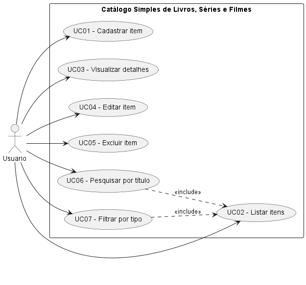
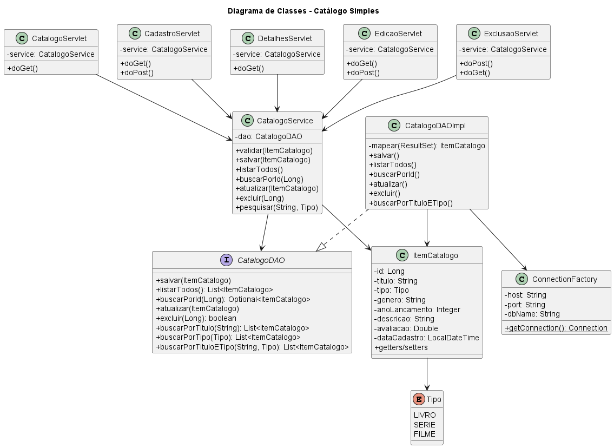
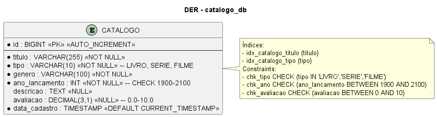

# Catálogo Simples de Livros, Séries e Filmes

Projeto web acadêmico CRUD em **Java** para cadastro e gerenciamento de livros, séries e filmes. Foco em simplicidade, organização e boas práticas.

## Objetivo
Permitir ao usuário:
- Cadastrar livros, séries e filmes
- Visualizar lista completa e detalhes
- Editar e excluir itens
- Pesquisar por título (`LIKE %q%`) e filtrar por tipo

## Tecnologias
- **Java 17 LTS** (Temurin)
- **Jakarta Servlet 6.0** + **JSP 3.1** + **JSTL 3.0** (Tomcat 10.1)
- **JDBC** + **MySQL 8** (mysql-connector-j 8.0.33)
- **Maven 3.9.9**
- **JUnit 5.10.2** + Mockito 5.8.0
- **HTML5 / CSS3**
- **IntelliJ IDEA** (recomendado)

## Arquitetura
```
JSP (View, EL/JSTL, c:out, c:forEach)
  ↓ GET/POST
Servlet (Controller) - valida entrada, chama Service
  ↓
Service (CatalogoService) - regras de negócio e validação
  ↓
DAO (CatalogoDAO / CatalogoDAOImpl) - único lugar com SQL (PreparedStatement)
  ↓
ConnectionFactory (JDBC)
  ↓
MySQL (catalogo_db.catalogo)
```
- Nenhum SQL em Servlet/JSP, nenhuma regra de negócio em JSP.
- `try-with-resources` para `Connection/PreparedStatement/ResultSet`.
- Sem Spring/Hibernate/JPA (exigência).

## Estrutura
```
src/main/java/br/com/catalogo/
  ├── model/      Tipo.java, ItemCatalogo.java
  ├── dao/        CatalogoDAO.java, CatalogoDAOImpl.java
  ├── service/    CatalogoService.java
  ├── controller/ CatalogoServlet, CadastroServlet, EdicaoServlet, ExclusaoServlet, DetalhesServlet
  └── util/       ConnectionFactory.java
src/main/resources/db.properties.example
src/main/webapp/
  ├── WEB-INF/web.xml
  ├── css/style.css
  ├── index.jsp, lista.jsp, cadastro.jsp, editar.jsp, detalhes.jsp, erro.jsp
sql/01_schema.sql
docs/*.puml (UML + DER)
src/test/java/br/com/catalogo/service/CatalogoServiceTest.java
```

## Requisitos
- JDK 17+
- Maven 3.9+
- MySQL 8.0+
- Tomcat 10.1+ (compatível com Jakarta Servlet 6.0)
- IntelliJ IDEA ou Eclipse

> Se usar Tomcat 9, troque dependências para `javax.servlet` 4.0.1 + `javax.servlet.jsp.jstl` 1.2.

## Como configurar o MySQL
1. Crie o banco e tabela:
```bash
mysql -u root -p < sql/01_schema.sql
```
Ou manualmente:
```sql
CREATE DATABASE catalogo_db CHARACTER SET utf8mb4 COLLATE utf8mb4_unicode_ci;
USE catalogo_db;
-- ver sql/01_schema.sql para DDL completo
```
2. Configure credenciais:
```bash
cp src/main/resources/db.properties.example src/main/resources/db.properties
# edite db.properties com seu usuário/senha
```
Ou use variáveis de ambiente: `DB_HOST`, `DB_PORT`, `DB_NAME`, `DB_USER`, `DB_PASSWORD`.

Tabela `catalogo`:
| coluna | tipo | obs |
|---|---|---|
| id | BIGINT PK AI |  |
| titulo | VARCHAR(255) | NOT NULL |
| tipo | VARCHAR(10) | LIVRO/SERIE/FILME |
| genero | VARCHAR(100) | NOT NULL |
| ano_lancamento | INT | 1900-2100 |
| descricao | TEXT | nullable |
| avaliacao | DECIMAL(3,1) | 0-10, nullable |
| data_cadastro | TIMESTAMP | DEFAULT CURRENT_TIMESTAMP |

## Como configurar o projeto
```bash
git clone <seu-fork>
cd catalogo-simples
mvn clean compile
```

IntelliJ:
1. Open → selecione `pom.xml` → Open as Project
2. File → Project Structure → SDK 17
3. Run → Edit Configurations → Add Tomcat Server Local → Artifact `catalogo-simples:war exploded` → Deploy

## Como executar
```bash
mvn clean package
# gera target/catalogo-simples.war
# deploy em Tomcat 10.1: copie para webapps/ ou use via IntelliJ
```
Acesse:
- http://localhost:8080/catalogo-simples/ → `index.jsp`
- http://localhost:8080/catalogo-simples/catalogo → lista
- http://localhost:8080/catalogo-simples/cadastro → cadastro

## Como executar os testes
```bash
mvn test
# 15 testes unitários do Service (mock DAO, sem MySQL real)
```
Teste de integração DAO (opcional, não incluso por padrão) exigiria MySQL real e seria separado.

## Exemplos de uso
- **Pesquisa:** `GET /catalogo?q=Harry` encontra "Harry Potter e a Pedra Filosofal"
- **Filtro:** `GET /catalogo?tipo=FILME` lista apenas filmes
- **Combinado:** `GET /catalogo?q=Harry&tipo=LIVRO`

Validações (Service):
- Título 2-255, gênero 2-100, tipo obrigatório, ano 1900-(anoAtual+2), avaliação 0-10 ou nula.

## Javadoc
```bash
mvn javadoc:javadoc
# saída em target/site/apidocs/
```

## UML / DER

### Diagrama de Casos de Uso


### Diagrama de Classes


### DER (Diagrama Entidade-Relacionamento)


> Arquivos fonte PlantUML em `docs/*.puml`. Renderize com https://plantuml.com/ ou plugin IntelliJ PlantUML.

## Segurança
- Todos os SQL via `PreparedStatement` (anti SQL Injection)
- `c:out` em todos os JSPs (anti XSS)
- Sem scriptlets `<% %>`, sem SQL em Servlets/JSPs
- Validação server-side (não confiar no navegador)
- Credenciais fora do Git (`.gitignore` cobre `db.properties`, `.env`)
